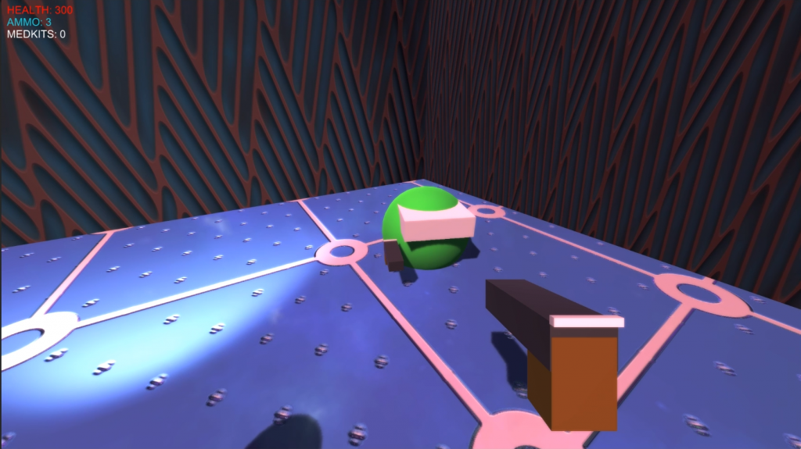
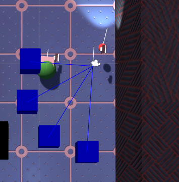
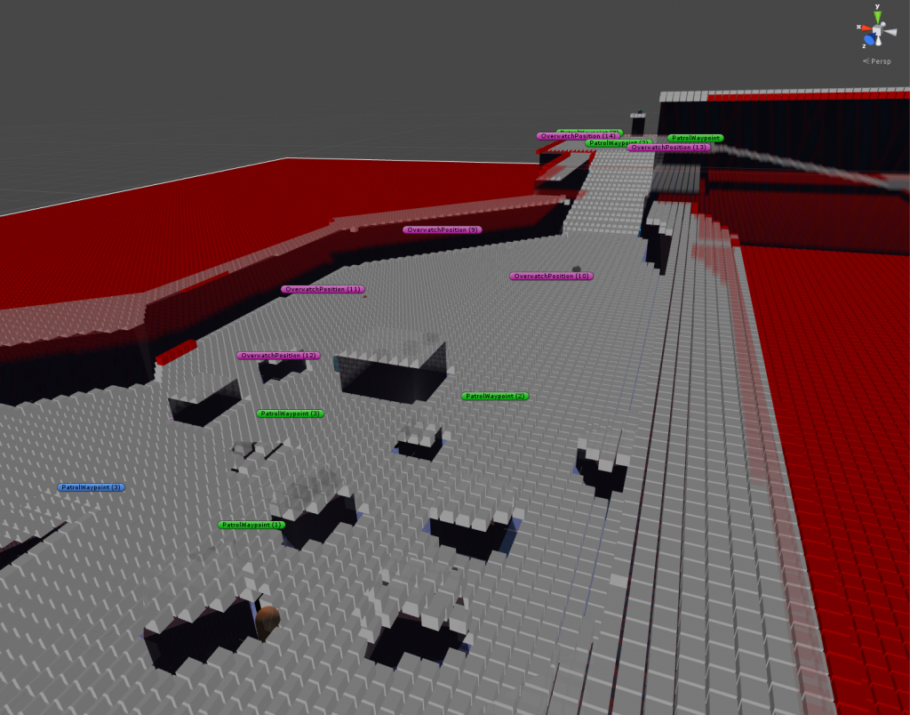
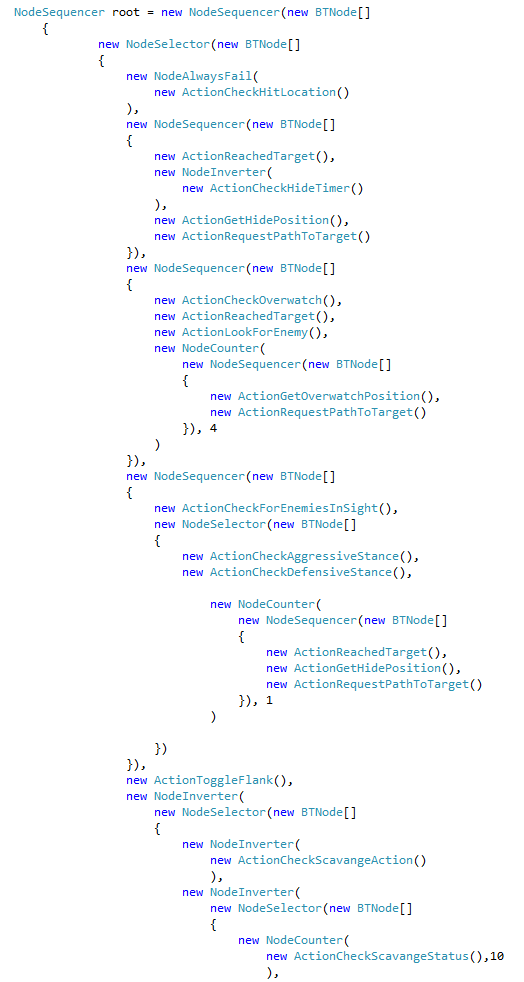

For a final year project whilst at university, I built a game within Unity 3D game engine to showcase the use of behaviour trees. The game features a dynamically created pathfinding grid with terrain movement costs, with AI using the A* algorithm, as well as full behaviour trees for a variety of AI types.

<a href="https://github.com/EllAyling/AI-Companion" class="project-link"><button class="btn btn-default btn-lg" style="margin: 0 0 15px 0"><i class="fa-brands fa-github fa-lg"></i>Github</button></a> 

<figure class="figure">
  
  <figcaption class="figure-caption text-left">The companion</figcaption>
</figure>

<figure class="figure">
  
  <figcaption class="figure-caption text-left">Visualisation of the companion determining follow positions</figcaption>
</figure>

<figure class="figure">
  
  <figcaption class="figure-caption text-left">Pathfinding nodes visualised</figcaption>
</figure>

<figure class="figure">
  
  <figcaption class="figure-caption text-left">Code of a behaviour tree</figcaption>
</figure>
